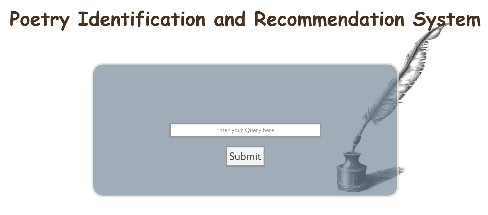
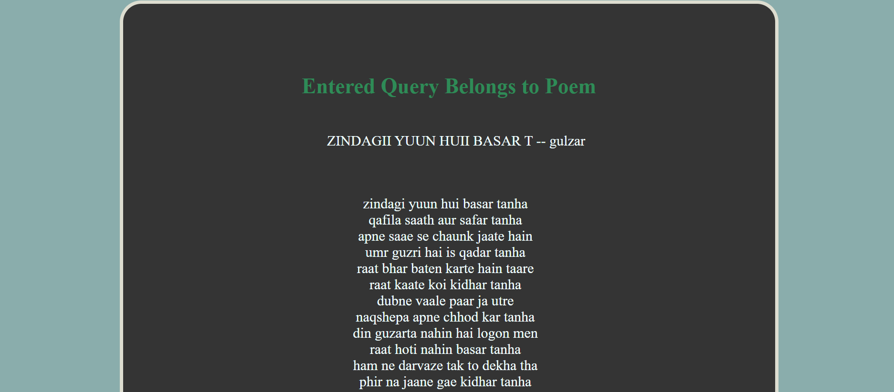
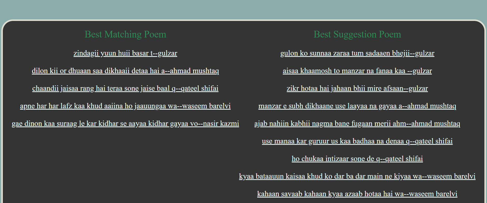
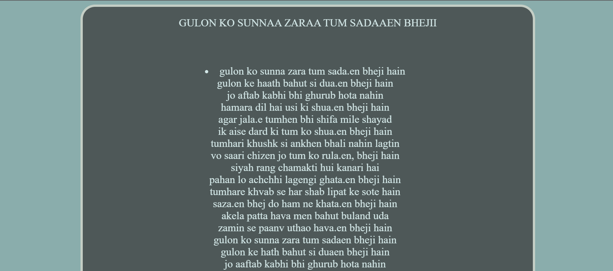

# Poetry Identification and Recommendation System
The *Poetry Identification and Recommendation System aka PIRS* is a web app which identifies the actual poem, retrieves the 5 best matching Poems and 10 recommendations based on the query entered by user.

The *PIRS* UI looks like following:

# To Run This Repo
*1. Clone the Repo*

> Download the pickle files from [here](https://drive.google.com/drive/folders/1cCUZ6woLVC89NDFS0wQYtUmbJozj8yYK?usp=sharing) or use the link in "Link_to_pickle" file for fast execution and loading of pages.

*2. Run app.py file in your system*

> enter flask run in your terminal and go to the server link. 

*3. Enter your query in the home box query page*

> Go to result page and click matching poems or suggestions for exploring more.

*4. Further details on remaining files*

- Poems : This folder contains all the data scrapped from cited source.
- Static : Contains the css and image files.
- Templates : has all the html files in it.
- BM, Tf-Idf and Posting list : contain the jupyter notebooks having the code for various retrieval techniques.
- higlish_spellcheck.py and scrap.ipynb : form the files for scrapping and preprocessing of data.

> Tools and Technologies used
- [Python 3.9](https://www.python.org/downloads/release/python-396/) - widely used programming language
- [flask](https://flask.palletsprojects.com/en/2.1.x/) - popularly used web framework
- Libraries used : numPy, Pandas, nltk, Beautifulsoup, unidecode etc.
- [Visual Studio Code](https://code.visualstudio.com/)